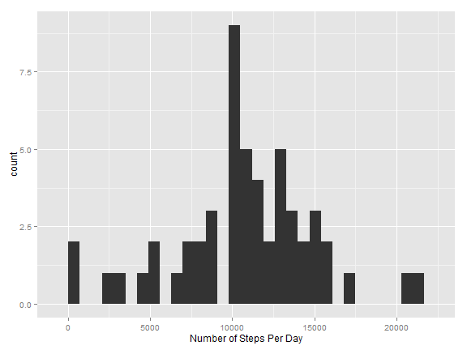
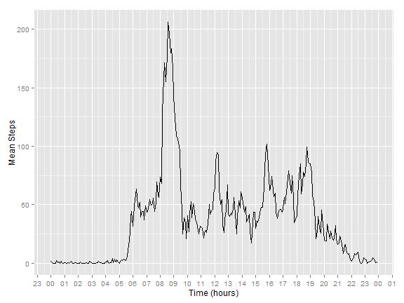
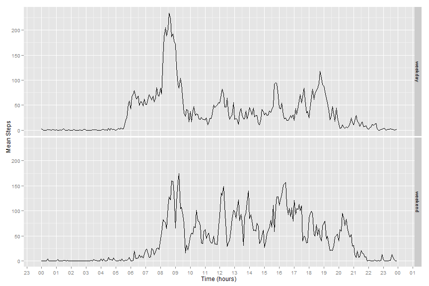
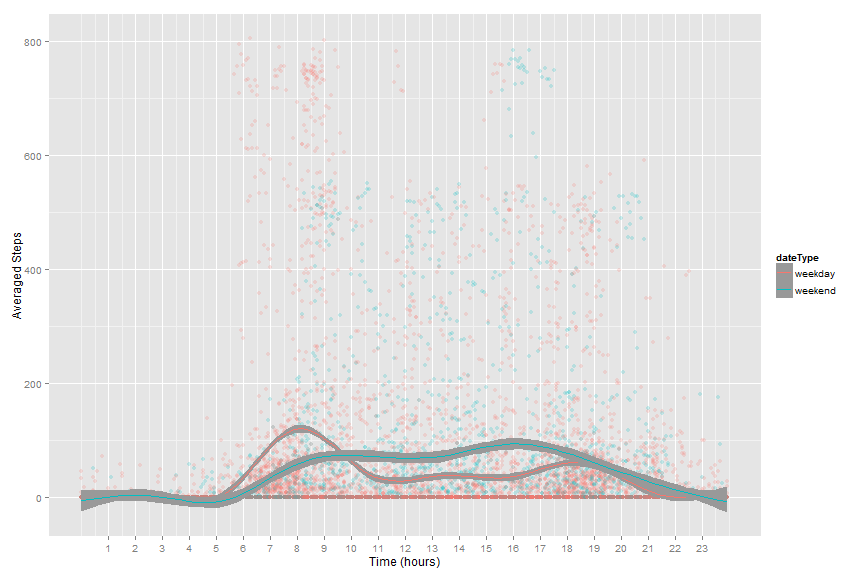

# Reproducible Research: Peer Assessment 1


## Loading and preprocessing the data


```r

myFile <- {
    if (file.exists("activity.csv")) 
        file("activity.csv", "r") else if (file.exists("activity.zip")) 
        unz("activity.zip", "activity.csv") else stop("activity file was not pulled from repo. Stopped.")
}

activity <- read.csv(myFile, stringsAsFactors = FALSE)
# connection is closed whien EOF is reached. generates an error on explicit
# close. close(myFile)
```


Pre-processing data. Adding full time element from date/interval field.


```r
activity$DateTime = as.POSIXct(strptime(paste(activity$date, sprintf("%04d", 
    activity$interval)), format = "%Y-%m-%d %H%M"))
```


## What is mean total number of steps taken per day?
For this part of the assignment, you can ignore the missing values in the data set.


```r
library(data.table)
library(ggplot2)
AD <- data.table(activity)
#### creating a data table that contains number of steps taken per day
ActDate <- AD[, list(stepsDaily = sum(steps)), by = date]
# setnames(ActDate,names(ActDate), c('date', 'StepsDaily')) this puts 0
# insted of NAs AA1<-AD[,sum(steps,na.rm=T),by=date]

#### Mean steps per day
ActDate[, mean(stepsDaily, na.rm = T)]
```

```
## [1] 10766
```

```r

#### Median steps per day
ActDate[, median(stepsDaily, na.rm = T)]
```

```
## [1] 10765
```

```r

qplot(stepsDaily, data = ActDate, binwidth = 700, xlab = "Number of Steps Per Day")
```

 


Mean total number of steps per day was
10766

Median total number of steps per day was
10765

These numbers are calculated *before* imputing missing data.

## What is the average daily activity pattern?

### Make a time series plot 
(i.e. type = "l") of the 5-minute interval (x-axis) and the average number of
steps taken, averaged across all days (y-axis)

Note: this plot is better then the one show in the panel plot in assignment as 
it is ploted on the time scale and dose not have data gaps between minutes like
you wold have for example between 755 and 800. (A gap of 45 points, approximated
by a straight line). 
The plot below displays data correctly on a continuous scale.


```r
#### caclucalte interval mean steps
IntervalMean <- AD[, list(meanSteps = mean(steps, na.rm = T)), by = list(interval)]
dtm <- strptime(with(IntervalMean, sprintf("%04d", interval)), format = "%H%M")

#### We will plot x axis on the time scale load libraries needed to scale x
#### axis according to time
library(scales)

meanPlot = ggplot(IntervalMean, aes(dtm, meanSteps)) + geom_line() + ylab("Mean Steps") + 
    xlab("Time (hours)") + scale_x_datetime(labels = date_format("%H"), breaks = "1 hour")
print(meanPlot)
```

 


### Which 5-minute interval, on average across all the days in the dataset, contains the maximum number of steps?


```r
i <- which.max(IntervalMean$meanSteps)
IntervalMean$interval[i]
```

```
## [1] 835
```

Interval that corresponds to 8:35 AM has a maximum mean number of steps averaged
over all days

## Imputing missing values

1. Calculate and report the total number of missing values in the data set

```r
#### complete.cases returns logical, sum returns number of conditions eval to
#### 'true'
dim(AD)[1] - sum(complete.cases(AD))
```

```
## [1] 2304
```


1.1 Total number of missing cases is 2304


* Strategy for filling in missing cases

Strategy for dealing with missing values: replace missing values with the mean values for that 5-minute interval

* Create a new data set that is equal to the original data set but with the missing data filled in.


```r
setkey(AD, interval)
setkey(IntervalMean, interval)
iAD <- AD[IntervalMean]
iAD[is.na(steps), `:=`(steps, as.integer(meanSteps))]
#### will drop columns that are not in original dataset
iAD[, `:=`(DateTime = NULL, meanSteps = NULL)]
#### verify that there are no missing values now
dim(iAD)[1] - sum(complete.cases(iAD))
```


* Make a histogram of the total number of steps taken each day and Calculate and report the mean and median total number of steps taken per day


```r
imputeMean <- iAD[, list(meanSteps = mean(steps, na.rm = T)), by = list(interval)]
# idtm <- strptime(with(imputeMean, sprintf('%04d', interval)),
# format='%H%M')

impHistPlot = qplot(stepsDaily, data = ActDate, binwidth = 700, xlab = "Number of Steps Per Day")

print(impHistPlot)
```

 


Note: the string below is calculated (please see source)

Median number of total steps: 10641
Mean number of total steps: 10749

Median number of steps per day stayed the same with imputed data and the mean number of steps is now lower with our imputation method.


## Are there differences in activity patterns between weekdays and weekends?
1. Create a new factor variable in the data set with two levels – “weekday” and “weekend” indicating whether a given date is a weekday or weekend day.


```r
sAD <- copy(AD)
#### creating factor variable. invisible is to prevent printing data here
invisible({
    sAD[, `:=`(dayNo, strptime(date, "%Y-%m-%d")$wday)]
    sAD[, `:=`(dateType, "weekday")]
    sAD[dayNo %in% c(0, 6), `:=`(dateType, "weekend")]
    sAD[, `:=`(dateType, as.factor(dateType))]
})

#### adding continuos time variable to the data set manually
sAD[, `:=`(dHM, {
    dH = as.numeric(substr(sprintf("%04d", interval), 1, 2))
    dM = as.numeric(substr(sprintf("%04d", interval), 3, 4))
    dH + dM/60
})]
```

```
##        steps       date interval            DateTime dayNo dateType   dHM
##     1:    NA 2012-10-01        0 2012-10-01 00:00:00     1  weekday  0.00
##     2:     0 2012-10-02        0 2012-10-02 00:00:00     2  weekday  0.00
##     3:     0 2012-10-03        0 2012-10-03 00:00:00     3  weekday  0.00
##     4:    47 2012-10-04        0 2012-10-04 00:00:00     4  weekday  0.00
##     5:     0 2012-10-05        0 2012-10-05 00:00:00     5  weekday  0.00
##    ---                                                                   
## 17564:     0 2012-11-26     2355 2012-11-26 23:55:00     1  weekday 23.92
## 17565:     0 2012-11-27     2355 2012-11-27 23:55:00     2  weekday 23.92
## 17566:     0 2012-11-28     2355 2012-11-28 23:55:00     3  weekday 23.92
## 17567:     0 2012-11-29     2355 2012-11-29 23:55:00     4  weekday 23.92
## 17568:    NA 2012-11-30     2355 2012-11-30 23:55:00     5  weekday 23.92
```


2. Make a panel plot containing a time series plot (i.e. type = "l") of the 5-minute interval (x-axis) and the average number of steps taken, averaged across all weekday days or weekend days (y-axis).

Note: this plot is better then the originally assigned one as it is plotted on
the time scale and does not have
data gaps between minutes.For example you would have a gap of 45 minutes between
755 and 800 if plotted on a numeric scale; "missing" data would be approximated
by a straight line. 

The plot below displays data correctly on a continuous scale.


```r
mAD <- sAD[, list(meanSteps = mean(steps, na.rm = T)), by = list(dateType, interval)]

#### time scale x_ does not work with facets,
mHM <- as.POSIXct(strptime(paste("2014-01-01", sprintf("%04d", mAD$interval)), 
    format = "%Y-%m-%d %H%M"))

#### We will plot x axis on the time scale load libraries needed to scale x
#### axis according to time
library(scales)
library(ggplot2)
invisible(mAD[, `:=`(mHM, mHM)])

weekendPlot = ggplot(mAD, aes(mHM, meanSteps)) + geom_line() + ylab("Mean Steps") + 
    xlab("Time (hours)") + scale_x_datetime(labels = date_format("%H"), breaks = "1 hour") + 
    facet_grid(dateType ~ ., scales = "free_x")
print(weekendPlot)
```

 

```r

```


### Extra Considerations

Lets do a quick smoothed plot with default parameters to see the data on the same
chart.

```r
#### date calculations for scale_x_datetime(labels= date_format('%H'), breaks =
#### '1 hour' ) +

smoothPlot = ggplot(data = sAD, aes(x = dHM, y = steps, color = dateType)) + 
    ylab("Averaged Steps") + xlab("Time (hours)") + scale_x_continuous(limits = c(0, 
    24), breaks = c(1:23)) + geom_point(alpha = 0.2) + geom_smooth(alpha = 1)

print(smoothPlot)
```

```
## geom_smooth: method="auto" and size of largest group is >=1000, so using gam with formula: y ~ s(x, bs = "cs"). Use 'method = x' to change the smoothing method.
```

```
## Warning: Removed 1728 rows containing missing values (stat_smooth).
## Warning: Removed 576 rows containing missing values (stat_smooth).
## Warning: Removed 2304 rows containing missing values (geom_point).
```

 


Examining the plot reveals that we have a lot of data points that are close to 
zero measurements. This may suggest that a person shifts his activity during the
day. For the data analysis we might prefer to study cumulative activity per day.

Missing values for the 5-minute time period are more likely to be simply zeroes
with this hypothesis; if we are missing values for the day entirely we might
want to consider a different approach.
